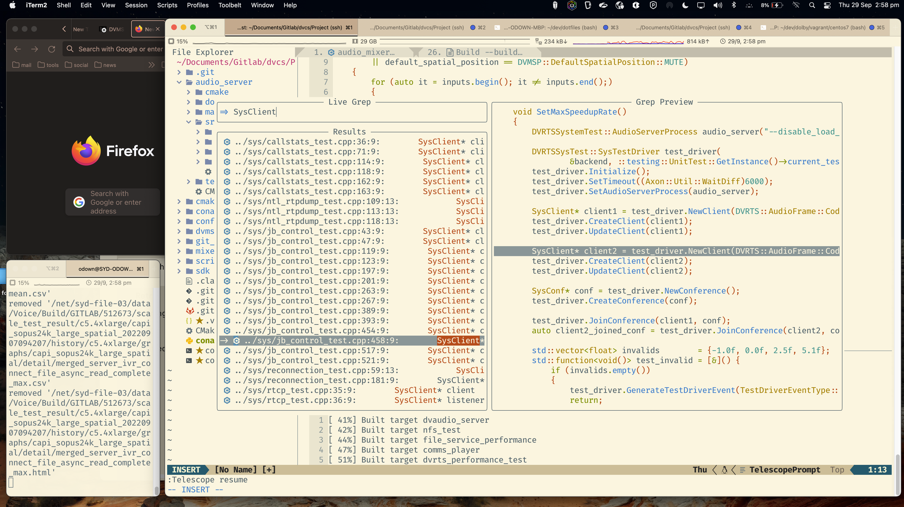

```
 _(`-')               (`-')                   _                 (`-')  _  (`-').-> 
( (OO ).->      .->   ( OO).->      <-.      (_)        <-.     ( OO).-/  ( OO)_   
 \    .'_  (`-')----. /    '._   (`-')-----. ,-(`-')  ,--. )   (,------. (_)--\_)  
 '`'-..__) ( OO).-.  '|'--...__) (OO|(_\---' | ( OO)  |  (`-')  |  .---' /    _ /  
 |  |  ' | ( _) | |  |`--.  .--'  / |  '--.  |  |  )  |  |OO ) (|  '--.  \_..`--.  
 |  |  / :  \|  |)|  |   |  |     \_)  .--' (|  |_/  (|  '__ |  |  .--'  .-._)   \ 
 |  '-'  /   '  '-'  '   |  |      `|  |_)   |  |'->  |     |'  |  `---. \       / 
 `------'     `-----'    `--'       `--'     `--'     `-----'   `------'  `-----'  
==================================================================================

_-_ _,,                                                          
   -/  )                                                         
  ~||_<   '\\/\\                                                 
   || \\   || ;'                                                 
   ,/--||  ||/                                                   
  _--_-'   |/                                                    
 (        (                                  |\                  
           -_-                    _           \\   '   _         
 /'\\  /'\\ /\\ '\\/\\ \\/\\/\\  < \, \\/\\  / \\ \\  < \,  _-_, 
|| || || ||  /   || ;' || || ||  /-|| || || || || ||  /-|| ||_.  
|| || || || /\\  ||/   || || || (( || || || || || || (( ||  ~ || 
\\,|| \\,/   ||  |/    \\ \\ \\  \/\\ \\ \\  \\/  \\  \/\\ ,-_-  
   ||        /  (                                                
   '`       (,   -_-                                             
==================================================================================
```

---
# Showcase



# Setup 
## Quick Setup
```
./push.sh \
&& ./bootstrap.sh
&& nvim +'PlugInstall'
```

## Script info
- `push.sh` sync's `.vimrc` and `.config` in this repo to your local root directory.
- `bootstrap.sh` downloads the latest neovim image and install the pluggins.

---

# Docker (WIP)

Start docker daemon:
```
sudo systemctl start docker
```

Build docker container:
```
sudo docker build -f  ./Dockerfile -t dev-box:v1.0  .
```

Run docker container:
```
sudo docker run --device=/dev/fuse -v /home/axon:/home/axon -it 6fbd974591a6 bin/bash
```

Run `:PlugInstall` nvim command at least once when you start using `nvim`.
Alternatively, run this once:
```
nvim +'PlugInstall'
```
---

```
 ___                                               
-   ---___- ,,                  ,- _~,        |\   
   (' ||    ||                 (' /| /         \\  
  ((  ||    ||/\\  _-_        ((  ||/= \\/\\  / \\ 
 ((   ||    || || || \\       ((  ||   || || || || 
  (( //     || || ||/          ( / |   || || || || 
    -____-  \\ |/ \\,/          -____- \\ \\  \\/  
              _/                                   
```
